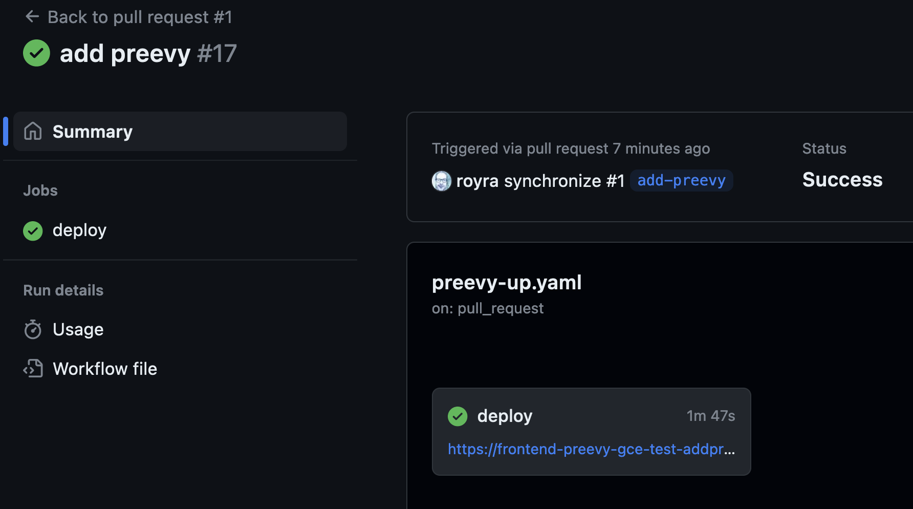
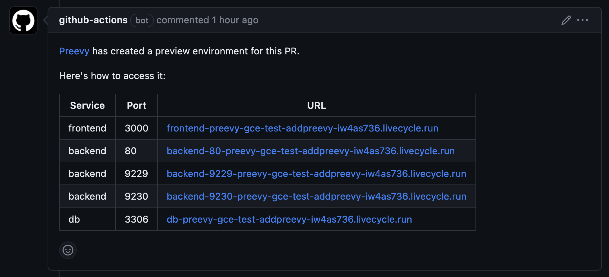
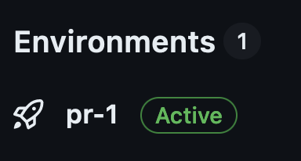
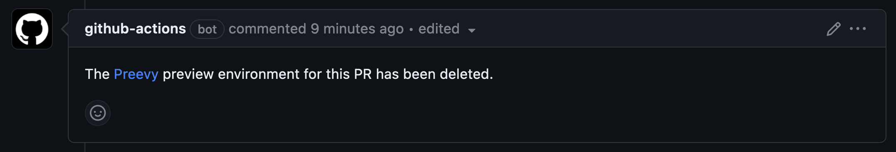

# Preevy + GitHub Actions + Google Cloud VMs

This repo demonstrates deploying a [Preevy](https://preevy.dev) environment per pull request. It also shows integration with GitHub deployments and [environments](https://docs.github.com/en/actions/deployment/targeting-different-environments/using-environments-for-deployment).

### For every PR opened or updated:
- Preevy will provision an [environment on a Google Cloud VM](https://preevy.dev/drivers/gcp-gce) with this PR content.
- A [comment](https://github.com/livecycle/preevy/tree/main/packages/plugin-github-pr-link#readme) with the environment URLs will be posted on the PR.

- A [GH environment](https://docs.github.com/en/actions/deployment/targeting-different-environments/using-environments-for-deployment) will be created (named `pr-NNN`, where NNN is the PR number) and shown on the repo main page.

### When the PR is closed
- Preevy will delete the GCE VM.
- The PR comment will be updated to reflect the fact that the Preevy environment no longer exists.

- The GH environment will be deleted (optional, see [below](#optional-delete-gh-deployments-and-environments-on-pr-closure)).

### To use the workflow:

- Create a [preevy profile](https://preevy.dev/intro/under-the-hood#profile-configuration) using the [Preevy init](https://preevy.dev/cli-reference/init) command and store it in a Google Cloud Storage bucket.
- Create the `PREEVY_PROFILE_URL` [GitHub Actions environment variable](https://docs.github.com/en/actions/learn-github-actions/variables#creating-configuration-variables-for-a-repository) and set it to the Preevy profile URL.
- Create a GCE service account, make sure it has the proper permissions to access the GKE cluster. Download its [credentials JSON file](https://github.com/googleapis/google-cloud-node#download-your-service-account-credentials-json-file) and paste it into the [GitHub Actions secret](https://docs.github.com/en/actions/security-guides/using-secrets-in-github-actions#creating-secrets-for-a-repository) `PREEVY_SA_KEY`.
- Copy the [`preevy_up.yaml`](./.github/workflows/preevy-up.yaml) and [`preevy_down.yaml`](./.github/workflows/preevy-down.yaml) GitHub Actions workflows to your repo.

### Optional: Delete GH deployments and environments on PR closure

To delete GH deployments and environments on PR closure, you need to setup a private GH App which will be used by the GHA flows. This is beacuse the default `GITHUB_TOKEN` [does not have enough permissions to delete those resources](https://github.com/marketplace/actions/delete-deployment-environment#how-to-obtain-the-proper-token).

To disable this feature, remove the last steps of the [`preevy_down.yaml`](./.github/workflows/preevy-down.yaml) workflow as documented in the file itself. You will have to remove the environments manually from the repo's "Environments" page.

After setting up the GH app:
- Set the GHA secret `GH_APP_PRIVATE_KEY` to the app private key.
- Set the GHA var `GH_APP_ID` to the app id.
- Install the app at the repo.

## Demo app

The demo Compose app in this repo is taken from the [`react-express-mysql` sample Compose app](https://github.com/docker/awesome-compose/tree/master/react-express-mysql) from the [Awesome Compose project](https://github.com/docker/awesome-compose) by Docker. See the [app README](/APP_README.md) for details.
